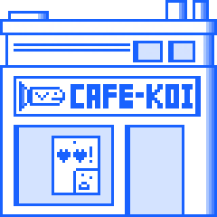

# DScript Format

> [**Go Back**](../README.md)

<br>

This guide gives an overview of the dialogue format used for `boggersJS`. It's meant to be
an easy to write format. This way, you don't have to worry about instantiating classes and
assembling the dialogue tree. You can just focus on writing out interactive scenes and banter!

# Syntax Overview

To be written.

# Example Script

This is an example dialogue script written in DScript format.

```
################### MAIN PATH
SPEAKER EMOTE M       
Example dialogue text.

SPEAKER EMOTE M       
Example dialogue text.

SPEAKER EMOTE C       
Example dialogue text.
Choice 1 -> LABELA
Choice 2 -> LABELB

################### LABEL A PATH
SPEAKER EMOTE M LABELA
Example dialogue text.

SPEAKER EMOTE M LABELA
Example dialogue text.

SPEAKER EMOTE C LABELA | split string by space
Example dialogue text. | read whole line
Choice 1 -> LABELC
Choice 2 -> LABELD

# NOT NEEDED BUT PUT FOR COMPLETENESS
CONVERGE LABELA

################### LABEL C PATH
SPEAKER EMOTE M LABELC | split string by space
Example dialogue text. | read whole line

CONVERGE LABELC

################### LABEL D PATH
SPEAKER EMOTE M LABELD | split string by space
Example dialogue text. | read whole line

CONVERGE LABELD

################### LABEL B PATH
SPEAKER EMOTE M LABELB | split string by space
Example dialogue text. | read whole line

SPEAKER EMOTE M LABELB | split string by space
Example dialogue text. | read whole line

CONVERGE LABELB

################### MAIN PATH
SPEAKER EMOTE M       
Example dialogue text.
```
